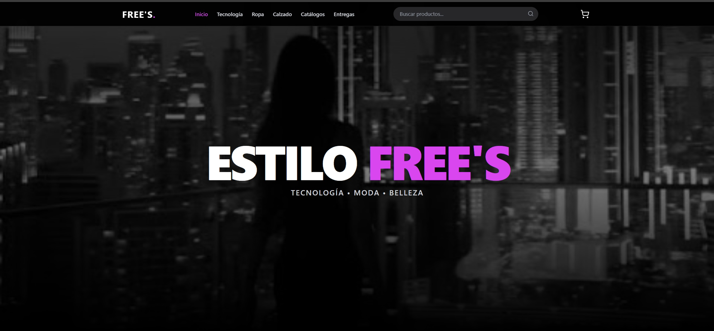
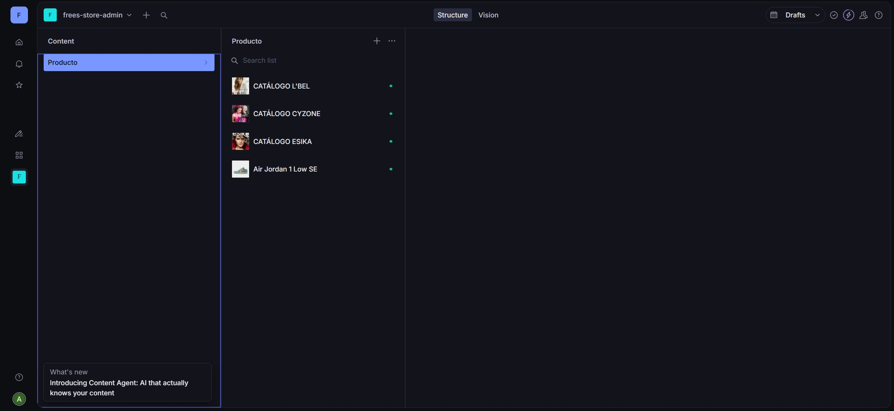

# 🛍️ FreeStore Fullstack E-commerce

Bienvenido al repositorio oficial de **FreeStore**. Una plataforma de comercio electrónico moderna, rápida y escalable, construida con las últimas tecnologías web. Este proyecto integra un frontend dinámico con un gestor de contenidos (Headless CMS) para una administración total de productos.




## 🚀 Tecnologías Utilizadas

Este proyecto utiliza una arquitectura moderna separando el Frontend del Backend (CMS).

### Frontend (Cliente)
* **React JS:** Librería principal para la interfaz de usuario.
* **Vite:** Empaquetador de última generación para una experiencia de desarrollo ultra rápida.
* **Tailwind CSS:** Framework de estilos para un diseño responsivo y moderno.
* **React Router:** Manejo de rutas y navegación.
* **Context API:** Gestión del estado global (Carrito de compras).
  
## 🚀 Demo en Vivo
[Ver el sitio en vivo](https://frees-store-peru.netlify.app/)

### Backend & CMS (Administrador)
* **Sanity.io:** Headless CMS para la gestión de la base de datos (Productos, Categorías, Banners).
* **Sanity Studio:** Panel administrativo visual personalizable.

## Captura del Panel ADmin en la DB


---

## 🛠️ Instalación y Configuración

Sigue estos pasos para correr el proyecto en tu máquina local.

### 1. Clonar el Repositorio

Abre tu terminal y ejecuta:

```bash
git clone [https://github.com/AbnerGA7/freestore-fullstack.git](https://github.com/AbnerGA7/freestore-fullstack.git)
cd freestore-fullstack
 ```
2. Configurar Variables de Entorno (¡Importante!)
Por seguridad, las llaves de acceso no están incluidas en el código. Debes configurarlas manualmente.

Busca el archivo .env.example en la raíz del proyecto.

Crea una copia de ese archivo y renómbralo a .env.

Ingresa tus credenciales (si no tienes una cuenta de Sanity, ve al paso "Crear Base de Datos"):

Contenido del archivo .env:
  ```bash

Fragmento de código

# ID de tu proyecto en Sanity
SANITY_STUDIO_PROJECT_ID=tu_id_aqui

# Dataset (usualmente es 'production')
SANITY_STUDIO_DATASET=production

# Número para recibir pedidos (formato internacional sin +)
VITE_WHATSAPP_NUMBER=51999999999
 ```
3. Instalar Dependencias
Este proyecto tiene dos partes que necesitan instalación: el Frontend y el Panel de Administración.

Instalar dependencias del Frontend (Raíz):

 ```Bash
npm install
 ```
Instalar dependencias del Backend (Carpeta admin):
 ```Bash
cd admin
npm install
cd "aqui es la ruta donde esta tu varpeta admin
```
🗄️ Cómo Crear y Conectar la Base de Datos (Sanity)
Si es la primera vez que corres el proyecto, necesitas inicializar Sanity.

Crea una cuenta gratuita en Sanity.io.

En tu terminal (dentro de la carpeta admin), inicia sesión:

 ```Bash
cd admin
npx sanity login
 ```
Obtén tu Project ID desde tu dashboard en la web de Sanity o ejecutando:

 ```Bash
npx sanity projects list
 ```
Copia ese ID y pégalo en tu archivo .env en la variable SANITY_STUDIO_PROJECT_ID.

▶️ Ejecutar el Proyecto
Necesitarás dos terminales abiertas para trabajar en Fullstack (una para ver la tienda y otra para editar productos).

Terminal 1: Frontend (Tienda Web)
 ```Bash
# En la raíz del proyecto
npm run dev
La tienda correrá usualmente en http://localhost:5173
 ```

Terminal 2: Backend (Panel Admin)
 ```Bash

cd admin
npm run dev
El panel administrativo correrá en http://localhost:3333
 ```

☁️ Despliegue (Deploy)
Pasos para subir tu proyecto a internet gratis.

1. Subir el Frontend (Vercel/Netlify)
Recomendado usar Vercel.

Crea una cuenta en Vercel.

Importa este repositorio desde GitHub.

IMPORTANTE: En la configuración de Vercel, agrega las "Environment Variables" (copia las mismas de tu archivo .env).

Dale a "Deploy".

2. Subir el Backend (Sanity Cloud)
Para que tu panel de administrador esté en internet:

 ```Bash
cd admin
npm run deploy
 ```
Te pedirá un nombre para tu estudio (ej: freestore-admin) y te dará una URL pública (ej: https://freestore-admin.sanity.studio).

📱 Funcionalidades Principales
✅ Catálogo de Productos: Actualizable en tiempo real desde Sanity.

✅ Carrito de Compras: Persistente y dinámico.

✅ Checkout por WhatsApp: Envía el pedido formateado directamente a tu chat.

✅ Panel de Administración: Sube fotos, cambia precios y edita stock sin tocar código.

✅ Diseño Responsive: Funciona perfecto en Celulares, Tablets y PC.

Desarrollado por AbnerGA7


